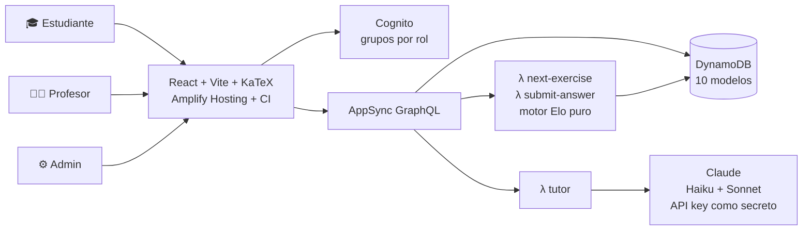

# GuIA ∞ — Plataforma de cursos adaptativos con IA

> **Un tutor 1:1 para cada estudiante, al costo de casi cero.** GuIA construye una ruta de aprendizaje que se recalcula con cada respuesta, y un tutor IA que explica con ejemplos y te dice *en qué libro, capítulo y página* profundizar — anclado a la bibliografía oficial del curso, sin inventar fuentes.

**🏆 Hackathon IA Masivo Online AWS por Código Facilito (Kiro + AWS) · julio 2026**

| | |
|---|---|
| 🌐 **Demo en línea** | https://main.dnshoh9una50.amplifyapp.com |
| 🎬 **Video** | *(enlace en el formulario de entrega)* |
| 📋 **Gestión del proyecto** | [GitHub Project — 26 issues con metodología, decisiones y correcciones](https://github.com/users/Causil/projects/9) |
| 🎨 **Prototipo aprobado** (9 pantallas, incluye visión P2) | [`design/prototipo-guia.html`](design/prototipo-guia.html) |
| 📐 **Modelo de datos** (draw.io) | [`design/modelo-datos-guia.drawio`](design/modelo-datos-guia.drawio) |

---

## 🎯 El problema

En LatAm, un docente atiende grupos de 30–40 estudiantes con un único ritmo para todos: quien se atrasa, se queda. La tutoría personalizada es cara y escasa. Y las plataformas existentes ofrecen **contenido estático** — el mismo video y el mismo PDF para todos, sin importar qué domina cada quien.

GuIA nace de un caso 100 % real: su autor dicta **Estadística (CBS00074)** en el Politécnico Colombiano Jaime Isaza Cadavid. El curso de la demo usa el **programa oficial FD-GC70**, su bibliografía real y los formatos institucionales verdaderos (guía didáctica FD-GC71, listado de asistencia).

## 💡 La solución y sus diferenciadores

1. **Ruta 100 % adaptativa y explicable** — un motor tipo Elo (determinista, sin IA generativa, 24 tests) recalcula el dominio por subtema tras cada respuesta y elige el siguiente reto en la *zona de desarrollo próximo*. Cada decisión se muestra con su **motivo** ("es donde más te cuesta", "bajé la dificultad tras 3 fallos").
2. **Tutor IA anclado a bibliografía real** — pistas socráticas que *jamás* revelan la respuesta (el prompt ni siquiera la recibe), explicaciones paso a paso con LaTeX, y citas exactas (Walpole cap. 11 pág. 389…) restringidas a los libros del curso: **imposible alucinar fuentes**.
3. **Cursos universitarios privados** — el docente crea el curso con el temario que exige su institución y matricula por el **listado XLSX oficial** (el parser tolera hasta el typo real "APLELLIDO" del formato 😄). El estudiante recibe invitación por correo y crea su contraseña en el primer ingreso. Sin matrícula, sin acceso.
4. **Eficiencia como principio** — el loop frecuente no usa IA generativa; el modelo se invoca solo bajo demanda, con caché y *fallback* elegante. Demo completa: **< 1 USD** de IA.

## 🚀 Pruébalo en 3 minutos ([demo](https://main.dnshoh9una50.amplifyapp.com))

**Credenciales demo (estudiante):** `estudiante.demo@guia.app` · `GuIA-2026!`
*(perfiles docente/admin: credenciales en el formulario de entrega — el panel docente se muestra en el video)*

| Paso | Qué observar |
|---|---|
| 1. Inicia sesión → **Mi curso** | Las 6 unidades reales del FD-GC70 con tu avance por subtema |
| 2. **Práctica** → responde 3-4 ejercicios | El mapa de dominio se mueve en vivo; la **Ruta adaptativa** explica cada decisión del motor; "Calificando…" = la Lambda validando en el servidor |
| 3. Falla una a propósito | Pista socrática; el motor **baja la dificultad** tras fallos seguidos |
| 4. **Chat del tutor**: escribe *"¿qué es la desviación estándar?"* | Claude responde desde nuestra Lambda con fórmulas KaTeX y **cita libro/capítulo/página** |
| 5. **Recarga la página (F5)** 🌟 | Todo tu progreso persiste — vive en DynamoDB, no en tu navegador |
| 6. Intenta entrar a `/docente` | Rebotado: *guards* por rol de Cognito |

## ⚙️ Qué está construido vs. cuál es la visión

| ✅ Funcional hoy (en la demo) | 🔭 Visión (diseñada en el [prototipo](design/prototipo-guia.html), roadmap) |
|---|---|
| Login Cognito con 3 roles + recuperación + **primer ingreso de matriculados** (invitación real por email) | Proctoring de exámenes: cámara + reconocimiento, monitoreo de ventanas, anti-pantallazos |
| Diagnóstico (niveles B/I/A) → dominio inicial en la nube | Avatar que explica en tablero con buzón de preguntas |
| Motor adaptativo como Lambdas (selección + calificación server-side; `answerIndex` nunca llega al navegador) | OCR de talleres resueltos en papel con calificación automática |
| Tutor IA real (chat/pista/explicación) vía AppSync + secreto | Informes institucionales auto-llenados (FD-GC71, asistencia) |
| Quiz con rúbrica y calificación automática | RAG sobre notas de clase y libros abiertos |
| Panel docente: heatmap del grupo, carga del listado (parser real), seguimiento | Generación de material (PDF extendido + Beamer) |
| Gamificación: XP/nivel/racha **global y por curso** | Modo clase en vivo con anotaciones |

## 🏗️ Arquitectura



**Decisiones clave** (detalle en [`docs/06-arquitectura-v2.md`](docs/06-arquitectura-v2.md)):
- **El motor no usa IA generativa** — funciones puras testeables (42 tests); barato, rápido (<1 s), explicable.
- **Seguridad por diseño** — *field-level auth*: `answerIndex/hint/explanation` son ilegibles para estudiantes; solo las Lambdas los ven. Progreso *owner-only*. Cursos privados con llave de matrícula (`Enrollment`).
- **Cliente de IA dual** — `LLM_PROVIDER=anthropic|bedrock` intercambiables con una variable; la API key viaja como **secreto de Amplify** (jamás en código, repo o navegador).
- **Contenido = datos** — cambiar de curso es cambiar el seed, no el código.

## 🤝 Metodología: 3 agentes, spec-driven

Este proyecto se construyó con un **equipo humano-IA** y disciplina de specs ([metodología completa en la issue #1](https://github.com/Causil/plataforma-educativa/issues/1)):

| Agente | Rol |
|---|---|
| 👤 **Javier** (docente/PO) | Decisiones de producto, insumos académicos reales, consolas, video |
| 🤖 **Claude** (Anthropic) | Specs, arquitectura, frontend, **review de cada cambio**, CI/deploys |
| 🟣 **Kiro** (AWS) | Backend por spec: schema de datos, Lambdas del motor, QA — guiado por [`.kiro/specs/aws-backend/`](.kiro/specs/aws-backend/) y [steering](.kiro/steering/) versionados |

Ciclo: requisitos → **prototipo interactivo aprobado** → arquitectura → tareas atómicas → build con *review* obligatorio (nada se integra sin tests+build verdes y revisión). Los errores también están documentados: ver las issues `fix:` del tablero — incluido el modelo que faltó en una entrega de Kiro y cazó el review 😉.

## 🧰 Stack

**Frontend:** React 18 · Vite · TypeScript estricto · KaTeX · i18next · CSS propio (tokens, claro/oscuro)
**Backend (AWS):** Amplify Gen2 · Cognito · AppSync GraphQL · DynamoDB · Lambda · Amplify Hosting (CI: los tests bloquean el deploy)
**IA:** Claude Haiku 4.5 (pistas/chat) + Claude Sonnet (explicaciones) — Anthropic API / Bedrock intercambiables
**Calidad:** Vitest (42 tests) · spec-driven con Kiro · GitHub Project

## 💻 Correr localmente

```bash
git clone https://github.com/Causil/plataforma-educativa && cd plataforma-educativa
npm install
npm test                      # 42 tests del motor, prompts y parser
npm run dev                   # UI en http://localhost:5173

# Backend propio (requiere cuenta AWS):
npx ampx sandbox --once --profile <tu-perfil>
npx ampx sandbox secret set ANTHROPIC_API_KEY --profile <tu-perfil>
GUIA_SEED_EMAIL=<admin> GUIA_SEED_PASSWORD=<pass> npx tsx scripts/seed.ts   # idempotente
```

Scripts útiles: `npm run tutor:lab` (REPL del tutor) · `scripts/api-smoke.ts` (motor en la nube) · `scripts/tutor-cloud-smoke.ts`.

## 📁 Estructura

```
docs/        especificaciones: requisitos R01–R24, arquitectura, tareas, insumos del Politécnico
design/      prototipo aprobado (9 pantallas) + modelo de datos draw.io
.kiro/       steering + spec ejecutable que guió a Kiro
amplify/     backend Gen2: auth, data (10 modelos), functions (motor + tutor)
src/engine/  motor adaptativo puro + tests   src/lib/tutor/  prompts y capa IA + tests
src/pages/   las 8 pantallas                 scripts/        seed y smokes
```

## 🔐 Privacidad

Los insumos institucionales reales con datos personales (listado de estudiantes) **nunca entraron al repositorio** — bloqueados por `.gitignore` desde antes del primer commit; se trabaja con réplicas anonimizadas.

---

**Autor:** Javier Andrés Causil Martínez — docente de Estadística (Politécnico Colombiano JIC / UdeA)
Construido para el Hackathon de Código Facilito con AWS y Kiro · 2026
