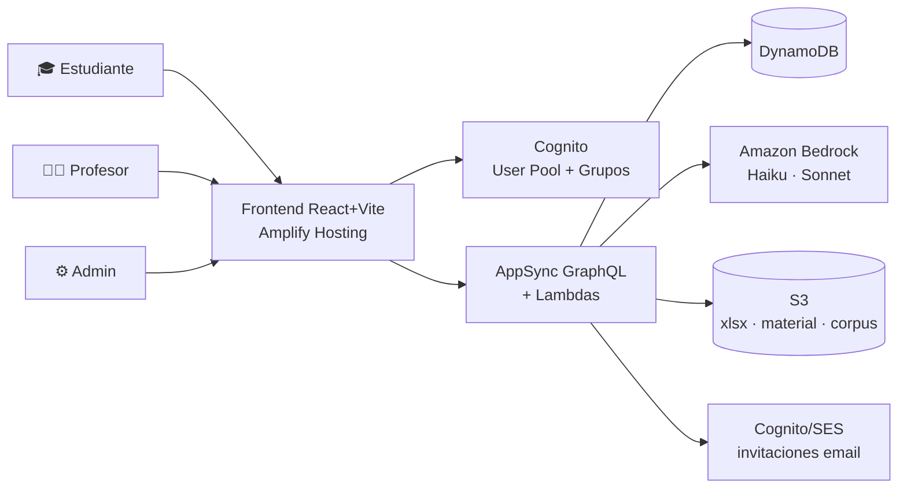

# GuIA — Arquitectura v2 (autoritativa)
### Plataforma de cursos adaptativos con IA · alcance R01–R24

> **Estado:** diseño aprobado sobre el prototipo v2.3 (aprobado 23-jul) y los insumos reales del Politécnico JIC.
> Reemplaza a `02-design.md` (v1, alcance "tutor de fracciones").
> **Regla de diseño:** todo lo P0 debe poder construirse y desplegarse antes del **27 jul 23:59 UTC-6**; lo P1/P2 tiene su camino trazado pero no bloquea.

---

## 1. Principios de arquitectura

1. **Serverless todo** — escala a cero, sin servidores que administrar, costo ~0 en reposo (criterio de eficiencia = 30% innovación).
2. **Amplify Gen2 como columna** — Auth + Data + Functions + Hosting en un solo proyecto TypeScript con IaC implícita y CI/CD desde GitHub. Menos glue-code = más velocidad con 4 días.
3. **IA por niveles según tarea** (no un modelo para todo):
   | Tarea | Modelo (Bedrock) | Razón |
   |---|---|---|
   | Pistas + chat del tutor | Claude **Haiku 4.5** | frecuente, barato, rápido |
   | Explicaciones paso a paso | Claude **Sonnet** | calidad/costo equilibrado |
   | Plan de estudio / temas difíciles | Claude **Fable 5** *(opción futura)* | máxima capacidad, solo tareas puntuales |
4. **El motor adaptativo NO usa IA generativa** — es un algoritmo determinista (Elo/BKT) en Lambda: barato, testeable, explicable al jurado.
5. **Contenido separado de plataforma** — cursos/unidades/ejercicios son datos, no código. Cargar otro curso = cargar otro seed.
6. **Privacidad primero** — PII de estudiantes nunca en el repo; cursos privados con autorización por matrícula.

## 2. Vista de contexto

## 3. Frontend

| Aspecto | Decisión |
|---|---|
| Base | **React 18 + Vite + TypeScript** |
| UI | CSS propio siguiendo el sistema visual del prototipo (teal #0FB5A6, papel cuadriculado, tema claro/oscuro) — sin framework pesado |
| Rutas por rol | `/` landing · `/login` · `/curso/:id` · `/practica` · `/evaluacion/:id` · `/docente/*` · `/admin/*` — guard por grupo Cognito |
| **Matemáticas (R23)** | **KaTeX** (paquete npm, render local, sin CDN en runtime crítico) — componente `<Math>{latex}</Math>` |
| **Gráficos (R24)** | 2 vías: (a) **SVG generados** (como la curva normal del prototipo) con componentes propios; (b) **function-plot** (D3-based, ligero) para interactivos. TikZ→SVG precompilado para figuras del material (build-time, no runtime) |
| i18n (R21) | **i18next** con `es` (P0) + `en` (P1) — textos en JSON desde el día 1 para no re-trabajar |
| Estado | React Query (server state) + contexto ligero; sin Redux |
| Gamificación (R22) | Cálculo en backend (fuente de verdad), render en cliente; puntos/rachas P0, insignias/niveles P1 |

## 4. Autenticación, roles y acceso (R01, R02, R05)

- **Cognito User Pool** con grupos: `students`, `teachers`, `admins`.
- **Recuperación de contraseña (R01):** flujo nativo de Cognito (`forgotPassword` → código por email).
- **Primer ingreso por matrícula (R02):** `AdminCreateUser` genera invitación por email con contraseña temporal → Cognito fuerza `NEW_PASSWORD_REQUIRED` en el primer login → el estudiante crea su contraseña. *Exactamente el flujo del prototipo, y es nativo de Cognito — costo de implementación bajo.*
- **Cursos privados:** `Course.visibility = public | private`. Toda query de contenido de curso pasa por regla de autorización: `private` ⇒ requiere fila en `Enrollment(courseId, studentId)`. Los profesores solo ven/gestionan sus cursos; admin ve todo.

## 5. Modelo de datos (DynamoDB vía Amplify Data)

**Jerarquía académica (del FD-GC70):**

| Modelo | Campos clave | Notas |
|---|---|---|
| `Course` | id, code (CBS00074), name, **visibility**, institution, teacherId, credits, status | público o privado |
| `Unit` | courseId, order, title | las 6 unidades |
| `Subtopic` | unitId, order, title, **bookRefs[]** {title, chapter, page} | 8 subtemas; refs = R10 |
| `Exercise` | subtopicId, level (básico/intermedio/avanzado), difficulty 1-5, type, prompt (LaTeX ok), options[], answerIndex, hint, explanation | banco |
| `Activity` | unitId, type (quiz/taller/examen), title, **rubric[]** {criterion, weight}, unlockThreshold | R13 |

**Estudiante y progreso:**

| Modelo | Campos clave | Notas |
|---|---|---|
| `Enrollment` | courseId, studentId, source (xlsx/self), document, status | matrícula; base del acceso privado |
| `MasteryState` | studentId, subtopicId, mastery 0-1, attempts, streak | motor adaptativo |
| `RouteLog` | studentId, step, subtopicId, difficulty, result, masteryBefore/After, reason, ts | ruta visible R06 |
| `Submission` | activityId, studentId, answers, score, rubricScores[], ocrText? | entregas R13/R15 |
| `UsageEvent` | studentId, type (login/view/practice), route, duration, ts | analítica R03 |
| `Attendance` | courseId, sessionDate, studentId, present | asistencia (formato Poli) |
| `CourseEvaluation` | courseId, studentId, ratings{contenido, tutor, plataforma, evaluaciones}, comment | R16 |
| `GameState` | studentId, xp, level, badges[], streak | R22 |

## 6. Lambdas / API (AppSync mutations & queries)

| Función | Rol | IA |
|---|---|---|
| `getNextExercise` | motor: selecciona subtema+dificultad (zona de desarrollo próximo) | — |
| `submitAnswer` | actualiza mastery (Elo/BKT), RouteLog, GameState | — |
| `getHint` | pista socrática (nunca da la respuesta) con fallback local | Haiku |
| `chatTutor` | chat con contexto del subtema + bookRefs; responde con explicación/ejemplo/referencia | Haiku (Sonnet si "explícame a fondo") |
| `getExplanation` | explicación paso a paso, cacheada por exerciseId | Sonnet |
| `parseRoster` | lee XLSX (S3) con columnas del Poli → valida → `AdminCreateUser` + `Enrollment` + notificación | — |
| `gradeQuiz` | califica quiz contra rúbrica, guarda Submission | — |
| `trackUsage` | ingesta de UsageEvent (batch desde el cliente) | — |
| *(P2)* `generateReport` | llena FD-GC71 / asistencia (docx/xlsx templating) | Sonnet |
| *(P2)* `gradeOCR` | interpreta foto de solución en papel | Claude vision |

**Pipeline XLSX (R02) en detalle:** Frontend sube `.xlsx` a S3 (presigned) → `parseRoster` (SheetJS) valida encabezado real del Poli (`N°, DOCUMENTO, NOMBRE, PRIMER APELLIDO, SEGUNDO APELLIDO, CORREO ELECTRONICO`) → por cada fila: `AdminCreateUser` (email de invitación con contraseña temporal) + fila `Enrollment` → reporta resumen (creados/duplicados/errores) al docente.

## 7. Tutor IA y "universo de libros" (R09–R11)

**Fase P0 — referencias curadas (sin RAG):** cada `Subtopic` lleva `bookRefs[]` con la bibliografía oficial del FD-GC70 (Walpole, Devore, Montgomery — capítulo y página). El prompt del tutor recibe: subtema actual, mastery del estudiante, bookRefs → responde con explicación/ejemplo y cita la referencia. **Cero alucinación de fuentes, costo mínimo.**

**Fase P1 — RAG económico:** corpus en S3 con material SIN problema de copyright (notas de clase de Javier + OpenIntro/Estadística Abierta CC). Dos opciones, decidir por tiempo:
- *Simple (recomendada para el plazo):* chunking + embeddings **Titan** guardados en DynamoDB/S3, búsqueda por similitud en Lambda (corpus pequeño → no necesita vector DB).
- *Gestionada:* **Bedrock Knowledge Bases** (más setup + costo OpenSearch Serverless; solo si sobra tiempo).

**Reglas de prompts:** pista ≠ respuesta (regla dura); nivel de lenguaje según mastery; salida corta en pistas; explicaciones con KaTeX (`$...$` que el frontend renderiza).

## 8. Seguridad y privacidad

- PII de estudiantes: **nunca** en el repo (`.gitignore` ya cubre el listado real); seeds solo con datos inventados.
- Autorización: reglas por dueño (estudiante ve lo suyo), por grupo (teacher/admin) y por matrícula (cursos privados).
- Secretos: cero credenciales en código; IAM roles de Amplify para Bedrock/S3.
- Proctoring (R14, P2): se diseñará con consentimiento explícito y procesamiento efímero — declarado así en el video.

## 9. Costos AWS (estimación demo/hackathon)

| Servicio | Uso | Costo |
|---|---|---|
| Cognito, AppSync, DynamoDB, Lambda, S3, Amplify Hosting | volúmenes de demo | **Free tier / ~$0** |
| Bedrock Haiku (pistas/chat, ~500 llamadas dev+demo) | ~$0.5–2 | único costo real |
| Bedrock Sonnet (explicaciones, cacheadas) | ~$1–3 | bajo demanda |
| Titan embeddings (si P1, corpus pequeño) | <$1 | one-shot |
| **Total estimado** | | **< $10** (cubierto por créditos) |

## 10. Trazabilidad requisito → componente

| Req | Componente |
|---|---|
| R01 | Cognito forgotPassword + UI login |
| R02 | S3 + `parseRoster` + AdminCreateUser + Enrollment |
| R03 | `trackUsage` + UsageEvent (+ Attendance) |
| R04–R06 | Course/Unit/Subtopic/Activity + UI "Mi curso" |
| R07, R18 | S3 material (PDF/slides) + visor (P1) |
| R08 | Exercise.level + flujo diagnóstico |
| R09–R11 | `chatTutor`/`getHint`/`getExplanation` + bookRefs (+RAG P1) |
| R12, R14, R15, R17 | P2: avatar, proctoring, OCR (`gradeOCR`), `generateReport` |
| R13, R16 | Activity+rubric, `gradeQuiz`, CourseEvaluation |
| R19–R24 | Frontend: logo ∞, responsive, i18next, GameState, KaTeX, gráficos |

## 11. Riesgos y mitigaciones

| Riesgo | Mitigación |
|---|---|
| 4 días: Amplify+Bedrock se atraviesa | Día 1 termina con auth+data desplegados; el motor es puro TS testeable sin AWS |
| Bedrock no disponible en región | usar `us-east-1`; fallback: pistas predefinidas (ya diseñado) |
| XLSX real trae variaciones | parser tolerante (busca fila de encabezados, normaliza tildes) + reporte de errores por fila |
| RAG P1 no alcanza | P0 (refs curadas) ya cumple R10 visiblemente; RAG se narra como "en curso" |

---

**Siguiente paso del orden:** descomponer esta arquitectura en **tareas atómicas** (`07-tareas-atomicas.md`) → GitHub Project → build.
